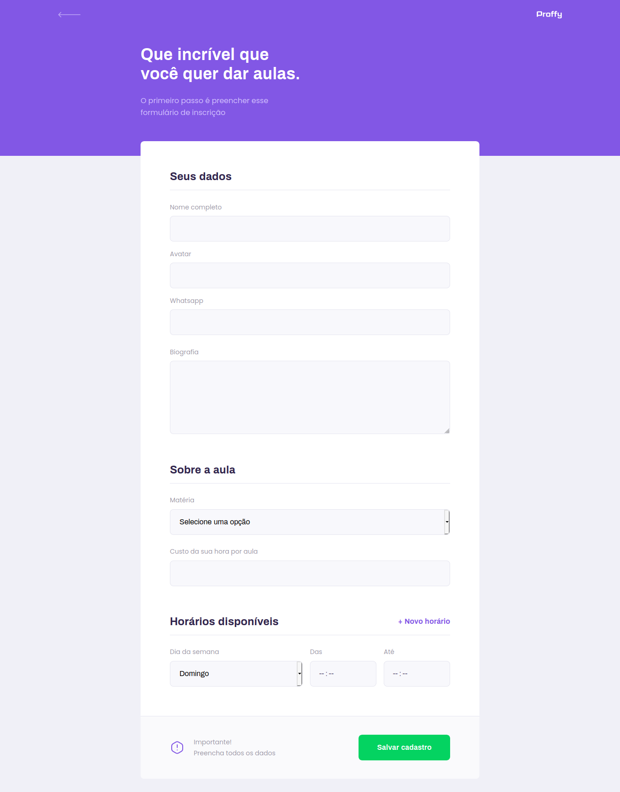
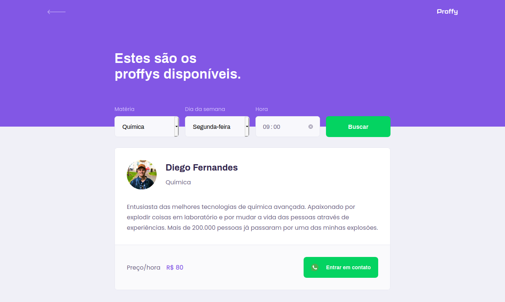
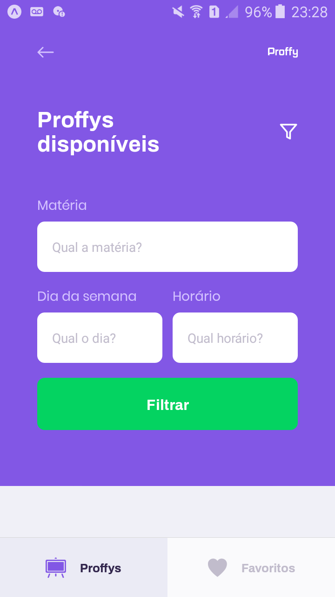

# NLW2
 
Aplicação desenvolvida durante o evento Next Level Week 2 da Rocketseat.
 Proffy é um projeto que visa conectar alunos com professores para realização de aulas online.

 
Na aplicação web os professores podem cadastrar informações como nome, biografia, matéria, preço por aula, número de contato, dia e horário das aulas. Os alunos podem acessar e filtrar essas informações
 por matéria, dia e horário.

 
No app mobile, o aluno consegue filtrar as aulas por matéria, dia da semana e horário para entrar em contato com o professor, além de poder adicionar e remover professores da aba de favoritos. O número de conexões feitas é contabilizado e exibido na página inicial de ambas as aplicações.

# Web

  

  

  

# Mobile

  
  
  

  
  

# Funcionalidades
## Web
 - Cadastro e listagem de professores.
 - Contato entre professor e aluno por Whatsapp.

## Mobile
 - Listagem dos professores cadastrados
 - Envio de mensagem Whatsapp
 - Favoritar professores

# Principais Tecnologias
 - Node.js
 - ReactJS
 - React Native
 - Expo
 - SQLite 
 - Knex
 - Cors